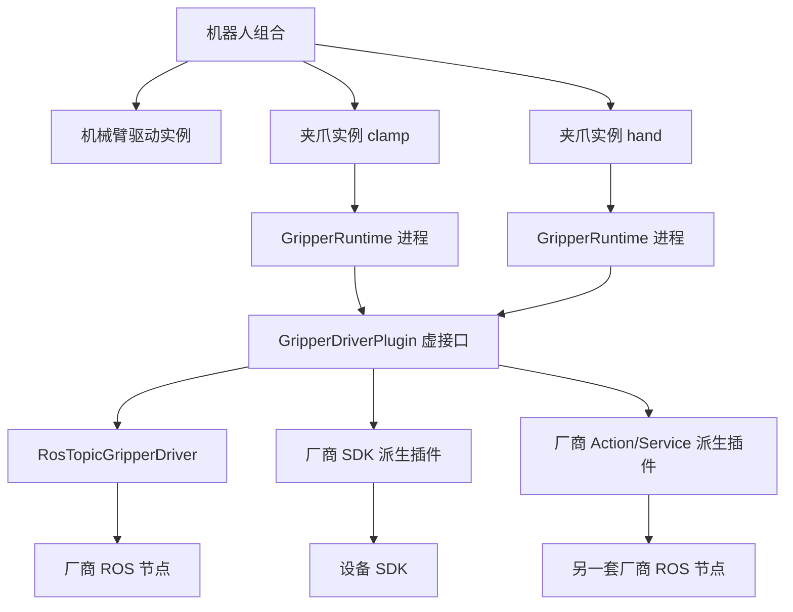

# 设备插件、虚接口与实例

通用层依赖抽象接口；设备协议由派生插件实现，节点与参数由实例配置提供。
换机型不需要修改管理器、统一启动入口或运行时。



`humanoid_driver_interface::GripperDriverPlugin` 定义纯虚函数，包括配置、连接、激活、
读取状态、写入命令、停止与健康检查。`GripperRuntime` 使用
`pluginlib::ClassLoader<GripperDriverPlugin>` 创建派生对象，持有基类指针并调用虚函数。
需要使用 ROS 的实现可继承 `Ros2GripperDriverPlugin`，取得当前实例的 ROS 节点；
直接使用 SDK/CAN 的实现可只继承基础接口。

目前已提供的具体夹爪实现是 `humanoid_gripper/RosTopicGripperDriver`，支持配置中的话题协议。
图中的 SDK 和 Action/Service 实现是扩展位置，并不是已经交付的通用转换器。
一个插件可管理多个相关夹爪；不同厂商或需要独立连接的设备分别创建实例，每个实例一个运行时进程。
厂商节点的名称、数量、话题、服务、Action 和消息类型不必一致，由对应插件封装。

## 配置多个实例

组合清单支持：

```yaml
plugins:
  hardware_driver: my_robot.driver
  robot_model: my_robot.model
  gripper_drivers:
    clamp: my_robot.gripper.clamp
    hand: my_robot.gripper.hand
```

旧的 `gripper_driver: plugin_id` 继续支持，与 `gripper_drivers` 互斥。
每个逻辑夹爪名称在整机内必须唯一。实例可共用平台 JointState 命令/反馈话题；
运行时过滤不属于自己的命令，其他夹爪的命令不会刷新本实例的看门狗。
实例 ID 为 `default` 时保留原节点名；其他实例使用 `humanoid_gripper_runtime_<instance_id>`。

配置页面可添加、移除实例，编辑各自参数、实例变量、启动步骤和公开能力。
添加同一插件的第二个实例时，需设置不同的逻辑名称和设备地址。参数化插件可以声明：

```yaml
instance_parameters:
  logical_name: clamp
  namespace: /vendor_a
  port: /dev/ttyUSB0
startup:
  - kind: launch
    package: vendor_a_bringup
    launch_file: device.launch.py
    arguments:
      device: ${port}
      namespace: ${namespace}
capabilities:
  grippers:
    ${logical_name}:
      open_position: 0.04
      closed_position: 0.0
```

资源 YAML 中的 `gripper_names: ['${logical_name}']`、厂商参数字符串和清单中的 schema
均可引用相同变量。变量值必须为字面字符串，不执行 shell。展开后再校验逻辑名称、话题和参数。
参数模板及变量保存在版本中，启动时向 ROS 节点传入展开后的参数。

保存、应用、导出、导入、复制和恢复均包含所有实例及其插件快照。恢复旧版本会取回当时的二进制插件，
不依赖已经从当前部署中移除的实例。插件选型变化后，启动依赖随所选插件一起变化。

## 参数规则和能力

插件可在清单中提供 `parameter_schema`（JSON Schema 2020-12，引用限清单内）。
管理器校验插件参数，不再识别厂商类名或维护厂商私有字段白名单。
`plugin_parameters` 仍为 `key=value` 列表；schema 的直接属性声明为 number、integer 或 boolean 时，
管理器按该类型解释值后校验。旧插件可不提供 schema，由其运行时实现继续负责私有参数校验。

手动开合测试使用 `capabilities.grippers.<逻辑名称>.open_position/closed_position/max_effort`，
或模型已经声明的遥操作开合目标。管理器不从厂商私有的 min/max 字段猜测目标。
能力中位置使用统一接口的单位，厂商值的缩放和偏移由插件映射处理。

当前夹爪统一接口覆盖位置控制（m 或 rad）和最大力度；它不是任意末端执行器的万能接口。
吸盘、压力控制或更复杂的灵巧手需要明确扩展接口能力或定义新的设备契约，不能把这些量伪装成米或弧度。
当前机械臂运动 SDK 只支持独立旋转关节；受控 prismatic、mimic 等关节在模型导入和运动服务启动时拒绝。
未受运动服务控制的夹爪移动关节可以保留在模型中。

## 相机与启动

配置列表决定相机数量，当前支持 0–16 台；不预设四台或固定安装位置。
RealSense 每台有独立型号、序列号、命名空间、节点名、彩色/深度话题和标准化采集输出话题。
多台设备必须使用不同序列号，启用的相机输出话题不能重复。

网页“夹爪驱动”中，每个逻辑夹爪都有“测试打开 / 测试闭合”，通过所属运行时执行并显示实测位置。
测试要求保存应用的版本正在运行，并停止遥操作使能。“相机配置”中，每台相机都有“测试拍照”，
读取保存配置中的对应图像话题，显示一帧照片或具体失败原因。拍照不要求机械臂启动，
但需要保存配置、启用 ROS 连接并启动对应相机；显示的序列号来自保存配置，不代表额外进行了设备身份回读。

相机配置可使用任意 backend 名称，声明 `startup`、`instance_parameters` 和标准化数据话题。
空 startup 表示使用外部已有 ROS 数据源；内置 RealSense profile 保留原配置兼容行为。
新厂商相机通过配置声明自己的启动步骤，无需修改 `multi_camera.launch.py`。
RealSense 的驱动参数、型号差异和时间适配独立在提供者模块中；通用包不强制安装 RealSense 驱动。
使用该 profile 的部署机需另外安装 `realsense2_camera` 及 `realsense2_camera_msgs`。
